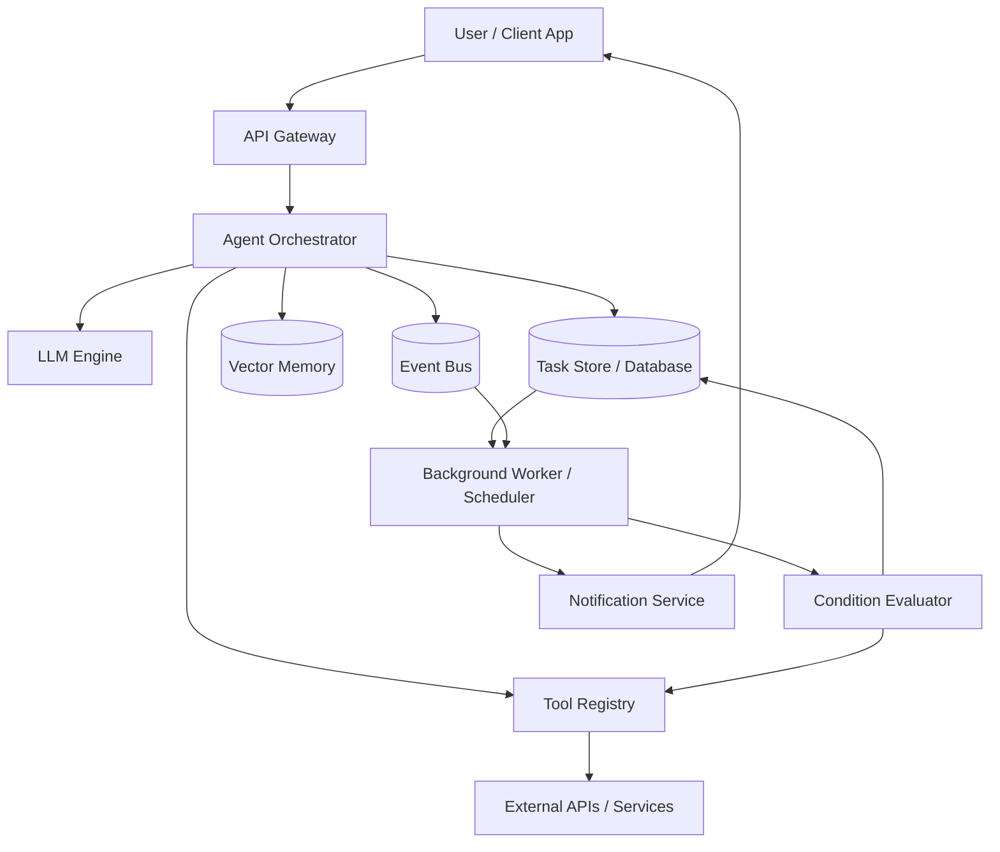
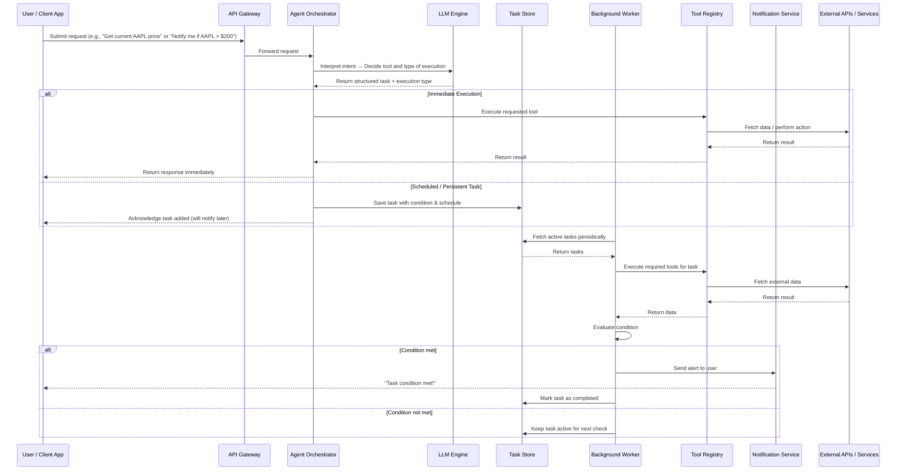

## Architecture Overview

The following **Event-Driven LLM Agent Architecture** shows the main components of Eventra:

The diagram above illustrates **Eventra’s architecture**: a stateful, event-driven LLM agent system.

* **Client / User App**: Submits requests or monitoring tasks.
* **API Gateway**: Handles authentication and routes requests.
* **Agent Orchestrator**: Interprets user intent via the LLM and decides whether to execute immediately or create a persistent task.
* **Task Store / Vector Memory**: Keeps tasks, workflows, and embeddings for long-term state.
* **Tool Registry**: Provides functions or APIs the agent can call.
* **Background Worker**: Periodically evaluates persistent tasks and triggers notifications.
* **Notification Service**: Alerts the user when task conditions are met.
* **External APIs / Services**: Supplies real-world data for tools to operate.

This architecture supports both **immediate tool execution** and **asynchronous monitoring**, giving the system flexibility to respond instantly or act autonomously over time.

